# 🃏 OOP Poker Game
**객체지향 설계 기반 카드게임 (Java 17 + Maven)**

---

## 📘 프로젝트 개요
- **목적:** OOP 설계 원칙(추상화, 다형성, 템플릿 메서드 패턴)을 학습하기 위한 포커 카드게임 구현
- **특징:** 인터페이스 → 추상클래스 → 구현클래스로 구조화된 계층적 설계
- **설계 패턴:** Template Method, Strategy
- **언어/환경:** Java 17, Maven

---
## ▪️과제 요구 사항

1. 게임 당 한벌의 카드만 사용. 카드 한벌은 서로 다른 52장의 카드로 구성.
2. 카드게임은 최대 4명의 플레이어가 참가 가능
3. 각 플레이어에게는 게임머니 10000원이 제공된다.
4. 각 플레이어는 자신만의 고유한 nickname을 가지며 nickname의 길이는 20자를 넘지못한다.
5. 딜러는 플레이어에게 서로 다른 5장의 카드를 나눠준다.
6. 딜러는 플레이어의 카드를 평가하고 결과를 점수로 반환한다.(점수가 높을 수록 좋음)
7. 카드의 평가는 일반적인 포커의 랭크를 참고하여 높은 랭크에게 더 높은 점수를 준다.
8. 매 게임마다 딜러는 각 플레이어의 카드를 평가하여 결과를 출력한다.
9. 게임에서 승리한 플레이어는 상금 100원과 1승이 추가되고 나머지 플레이어는 상금 0원과 1패가 추가된다.
10. 100번의 게임을 자동적으로 반복해서 실행하여 최종 결과를 승리의 수가 많은 플레이어부터 내림차순으로 정렬하여 화면에 출력한다.

---

## ⚙️ 주요 기능

| 도메인 | 클래스 구성 | 역할 |
|--------|--------------|------|
| **Card** | `Card`, `AbstractCard`, `PlayingCard` | 카드 한 장(무늬, 숫자) 정의 및 표현 |
| **Deck** | `Deck`, `AbstractDeck`, `StandardDeck` | 카드 덱 구성, 리셋, 셔플, 드로우 관리 |
| **Player** | `Player`, `BasicPlayer` | 닉네임, 잔액, 승패 카운트 관리 |
| **Dealer** | `Dealer`, `DealerImpl` | 카드 분배 및 승자 판정 |
| **Evaluator** | `HandEvaluator`, `PokerHandEvaluator` | 포커 족보 기반 점수 계산 |
| **Game** | `Game`, `AbstractGame`, `PokerGame` | 게임의 전체 생명주기(start → end) 및 라운드 로직 관리 |

---

## 🧩 카드게임 흐름

```mermaid
 sequenceDiagram
      participant Main
      participant PokerGame
      participant AbstractGame
      participant Dealer
      participant Deck
      participant Card
      participant Player
      participant HandEvaluator

      Main->>+Deck: new StandardDeck()
      Deck->>Deck: initialize()
      loop 52 cards (4 suits × 13 ranks)
          Deck->>+Card: new PlayingCard(suit, rank)
          Card-->>-Deck: card
          Deck->>Deck: cards.add(card)
      end
      Deck-->>-Main: deck

      Main->>+Player: new BasicPlayer(nickname) × 4
      Player-->>-Main: players (list)

      Main->>+HandEvaluator: new PokerHandEvaluator()
      HandEvaluator-->>-Main: evaluator

      Main->>+Dealer: new DealerImpl(evaluator)
      Dealer-->>-Main: dealer

      Main->>+PokerGame: new PokerGame(dealer, deck, players)
      PokerGame-->>-Main: game

      Main->>+PokerGame: start()
      PokerGame->>+AbstractGame: start()
      AbstractGame-->>-PokerGame: "게임 시작! 덱이 섞였습니다."

      loop 100 rounds
          PokerGame->>+Deck: reset()
          Deck->>Deck: cards.clear()
          Deck->>Deck: initialize()
          loop 52 cards
              Deck->>+Card: new PlayingCard(suit, rank)
              Card-->>-Deck: card
              Deck->>Deck: cards.add(card)
          end
          Deck->>Deck: shuffle()
          Deck-->>-PokerGame: 덱 초기화 완료

          PokerGame->>+Dealer: dealCards(players, deck)
          loop 5 times
              loop each player (4명)
                  Dealer->>+Deck: draw()
                  Deck->>Deck: cards.remove(0)
                  Deck-->>-Dealer: card
                  Dealer->>+Player: receiveCard(card)
                  Player->>Player: hand.add(card)
                  Player-->>-Dealer: 카드 수령 완료
              end
          end
          Dealer-->>-PokerGame: 카드 분배 완료

          PokerGame->>+Dealer: getWinner(players)
          loop each player
              Dealer->>+Player: getHand()
              Player-->>-Dealer: List<Card> hand
              Dealer->>+HandEvaluator: evaluate(hand)
              HandEvaluator->>HandEvaluator: 손패 평가 (족보 계산)
              HandEvaluator-->>-Dealer: score
          end
          Dealer->>Dealer: 최고 점수 플레이어 선정
          Dealer-->>-PokerGame: winner

          alt winner exists
              PokerGame->>+Player: addWin()
              Player-->>-PokerGame: 승리 카운트 증가
              PokerGame->>+Player: addMoney(100)
              Player-->>-PokerGame: 금액 증가
              loop losers
                  PokerGame->>+Player: addLose()
                  Player-->>-PokerGame: 패배 카운트 증가
              end
          end

          loop each player
              PokerGame->>+Player: clearHand()
              Player->>Player: hand.clear()
              Player-->>-PokerGame: 손패 초기화 완료
          end
      end

      PokerGame->>PokerGame: 최종 결과 정렬 및 출력

      PokerGame->>+AbstractGame: end()
      AbstractGame-->>-PokerGame: "게임 종료!"
      PokerGame-->>-Main: 게임 완료
```


---

## 🧠 설계 특징

| 항목 | 설명 |
|------|------|
| **Template Method 패턴** | `AbstractDeck.reset()` 내부에서 `initialize()` 호출 후 자동 `shuffle()` 수행 |
| **다형성 활용** | `HandEvaluator` 인터페이스로 다양한 평가 규칙 적용 가능 |
| **게임 생명주기 관리** | `Game` 인터페이스 → `AbstractGame`(공통 흐름) → `PokerGame`(구체 로직) 구조 |
| **유연한 확장성** | `BlackjackGame`, `AIPlayer`, `JokerDeck` 등 쉽게 추가 가능 |

---

## 🧮 포커 점수 계산 기준

| 족보 | 점수 |
|------|------|
| 로열 플러시 | 900 |
| 스트레이트 플러시 | 800 |
| 포카드 | 700 |
| 풀하우스 | 600 |
| 플러시 | 500 |
| 스트레이트 | 400 |
| 트리플 | 300 |
| 투페어 | 200 |
| 원페어 | 100 |
| 하이카드 | 0 |

---

## 💡 동작 흐름 요약

```text
Main
└── PokerGame.start()
├── deck.shuffle() (게임 시작)
├── 반복 (100회)
│ ├── deck.reset() + shuffle()
│ ├── dealer.dealCards()
│ ├── dealer.getWinner() → HandEvaluator.evaluate()
│ ├── 승자 +100원 / 패자 0원
│ └── hand.clear()
├── 결과 출력 (승 수 내림차순)
└── end() (게임 종료)
```

---

## 🎮 실행 방법

```bash
mvn clean compile
mvn exec:java -Dexec.mainClass='com.pokergame.Main'
```


```text
===== 포커 게임 시작 =====
===== Round 1 =====
Round 1 승자: 수진
===== Round 2 =====
Round 2 승자: 예린
...
===== 최종 결과 =====
민준 / 승: 27 / 패: 73 / 잔액: 12700
수진 / 승: 24 / 패: 76 / 잔액: 12400
예린 / 승: 25 / 패: 75 / 잔액: 12500
동재 / 승: 24 / 패: 76 / 잔액: 12400
게임 종료!
```
## 구조
```text
src/
 ├── main/java/com/pokergame/
 │    ├── card/
 │    ├── deck/
 │    ├── dealer/
 │    ├── evaluator/
 │    ├── player/
 │    └── game/
 │         ├── Game.java
 │         ├── AbstractGame.java
 │         └── PokerGame.java
 │
 └── test/java/com/pokergame/
      └── PokerHandEvaluatorTest.java

```


